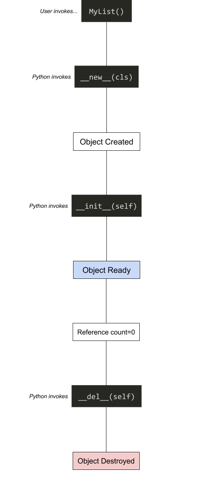

Magic methods (or _dunder methods_, because of the "**double under**scores" they start and finish with) are special methods defined in a class that start and end with two underscores. Example:

```python
class MyList:
    def __len__(self):
        pass
```

In this example, `__len__` is the magic method.

Most experienced developers fail to understand magic methods because they treat them as a "feature" of the language (example: _"Magic methods are used for operator overloading"_), when in reality, they're something a lot more profound: they're part of **Python's Data Model**.

Think about it as a "contract" that you sign with Python's interpreter: a common interface for your classes. For example, you can be sure that the method `__del__` will always be invoked before your object is garbage collected (to give you the chance to free resources, or clean things up). Sometimes, these methods do serve for operator overloading (the `__add__` method overloads the `+` operator), but they might also be used by other library writers (like the `__copy__` method, which is used by the `copy` module).

There are a lot of magic methods and new PEPs introduce new ones (the Python Data Model keeps growing, and there are new protocols added). The best guide for most magic methods is this one: https://rszalski.github.io/magicmethods/

In this post I'll focus on the ones that [you absolutely need to know](https://en.wikipedia.org/wiki/Pareto_principle).

## Life Cycle: object creation, initialization and destruction

Magic methods discussed:

* `__new__`
* `__init__`
* `__del__`

We tend to call the `__init__` method the "constructor" (specially people coming from a Java background, like myself). But in reality, it's an "initializer" method. Following this logic of "the contract between you and Python", you can be sure that after an object is created, Python will always invoke the `__init__` method giving you a chance to initialize properties of your object. The "real" constructor equivalent method in Python is `__new__` which is invoked with the class to create, but in reality it's rarely used.

The `__del__` method is invoked before Python garbage collects your object: its main use is to free up resources or do some clean up (closing files or database connections, for example). It's also rarely used.

In the following example, we create a new connection when our object is initialized (the `__init__` method) and we close it when it's finalized (the `__del__` method).

```python
class ORM:
    def __init__(self, username, password, host):
        self.conn = connect_db(username, password, host)

    def query(self, q):
        self.conn.execute(q)

    def __del__(self):
        self.conn.close()
```

Here's the full lifecyle of an object including magic methods:



These magic methods are clear examples of methods that you never manually call, but they're invoked by Python at certain points of the execution of your program.

## Operator Overloading

These methods are pretty self explanatory


* COMPARISON
*
