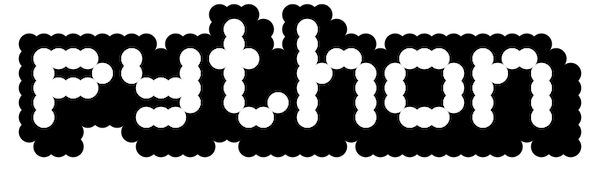

# Python Language - Meta Guide

All those tiny details that will eventually come up at a meetup and you need to look like you know your s#$t.

## History
The [Wikipedia article](https://en.wikipedia.org/wiki/History_of_Python) is very good. But this is what you need to know:

Python was created by a Dutch programmer named [Guido van Rossum](https://en.wikipedia.org/wiki/Guido_van_Rossum).

Python **is an old language**. Yes, I know it looks (and feels) modern, but it's been around for quite some time. Python's first public distribution was in February 1991.

<center>

<p class="img-footer">(Original Python logo from the 90s/early 2000s)</p>
</center>

Guido designed Python while he was working at the [CWI](https://en.wikipedia.org/wiki/Centrum_Wiskunde_%26_Informatica) research center in the Netherlands. Python was inspired by another language called [ABC](https://en.wikipedia.org/wiki/ABC_(programming_language)), that was also being developed at CWI. A clear result of the influence of ABC on Python is its usage of indentation, that Guido himself explains in this post: http://python-history.blogspot.com/2011/07/karin-dewar-indentation-and-colon.html

There's more to read about the history of Python. Guido has a few blogs in which he posts stubs from time to time: http://python-history.blogspot.com/


## Python versions

As mentioned in the previous section, Python is an old language. Today's most popular uses of Python are Web Development and Data Science. That didn't even exist at the moment Python was created, back in the 90s. Python has obviously evolved to accommodate to today's needs, and with that evolution came different versions.

Realistically, you only need to know that there are (were?) two major versions:  **Python 2 and Python 3**. Python 2 was the standard version when Python became "popular", I particularly started with Python 2.6 (back in 2008).


Python 2 was a major redesign of Python itself (what used to be Python 1). I don't know many people that used Python 1, so Python 2 was basically the standard. Most of the features we are used to in Python were added in Python 2.

But Python 2 was released in the year 2000, the standard CPU was the Pentium III. You can also guess that many of the decisions made at the time didn't adapt quite well to the modern world.

!!! tip
    Python 2 **is deprecated** and Python 3 is the version you should be using. More about this in the installation and setup section.

So Python 3 was born. It was actually conceived as Python 3000 or Py3K (I'm not kidding you, terrible names). The discussions about Python 3 started in the year 2006 with [PEP 3000]([PEP 3000 -- Python 3000 | Python.org](https://www.python.org/dev/peps/pep-3000/)) (I'll explain what PEPs are later). Python 3 was again a major redesign of the language, and more importantly, **it was NOT backwards compatible with Python 2**, which didn't appeal to many people. Many important changes were introduced in Python 3, like default unicode support ([PEP 3120]([PEP 3120 -- Using UTF-8 as the default source encoding | Python.org](https://www.python.org/dev/peps/pep-3120/))), print as a function, and others.

Python 3 was developed in parallel with Python 2 regular feature improvements, bugfixes and security patches. The core Python team knew Python 3 was the future and the better option, but it took time for the community to embrace it.

The result was that for a few years (between 2012-2018 I’d say), there were two incompatible languages being developed at the same time and it was chaotic. Libraries writers had to employ different tricks to make their packages compatible with both Py2 and Py3, and the community was divided.

With time, everybody understood that Python 3 was superior, and adoption increased rapidly.

**Python 2 was [deprecated on January 1st, 2020](https://www.python.org/doc/sunset-python-2/). Python 3 is the only supported version**.

## Features of the language
Python supports all modern paradigms: imperative, Object Oriented (multiple inheritance) and functional (althought it’s not purely functional). Python is interpreted, which means that most of the time, your programs will work across multiple platforms.

Python is dynamically typed, and has an acceptable type system. Python is also considered “strongly typed”, which is hard to define, but basically you won’t have strange behaviors like the ones in JavaScript or PHP (`“10” + 10` results in an error for example). There are very few implicit type conversions done by the interpreter.

In Python, everything is an object, and this is correctly implemented. The advantage is that all objects will support overwriting methods, and we can even extend built-in types.

This means that in Python, functions are [“first class objects”](https://en.wikipedia.org/wiki/First-class_function) (everything is an object after all) and that allows us to have that “functional” flavor with Python:

```python
>>> map(lambda x: x**2, [1, 2, 3, 4]
>>> [1, 4, 9, 16]
```

Functional programming in Python is not pure. It’s easy to introduce side effects and most collections are mutable. Functional programming in Python feels more like a “style”, than an enforced paradigm. In latter chapters we’ll see a few features, like Haskell inspired List Comprehensions, that feel more “functional”.

Related to OOP, there are two important concepts that I want to point out and might be worth taking a look right now: Duck Typing and Mixins. Skip to the OOP chapter to read more about them.

### Garbage Collection

Python’s GC works by reference counting. The interpreter keeps a count of how many references exist to an object, and when that count reaches 0, the memory used by that object is freed. This is an example:

```python
# memory allocated for object 1
x = 1
# memory allocated for object 3
x = 3

# at this point, the interpreter knows that there are
# no more references to 1, and it can free up the memory
```

Reference counting has advantages and disadvantages. To start with the good side, the main advantage of reference counting is its simplicity. At the beginning of the history of Python, when contributions were greatly needed, many programmers were able to contribute to Python because of the simplicity of its interpreter. People attribute the popularization of Python to how simple it was to modify the interpreter and create C extensions.

The disadvantages are twofold. First, reference counting is a GC algorithm considered “naive” and it can result in memory leaks or reference cycles more often than other more advanced (and modern) methods like “reference graphs”. And secondly, these reference counts are maintained in shared memory space within the process, which can be accessed and modified by any running thread. This could potentially result in race conditions, if it wasn’t by the introduction of the Python GIL, a global interpreter lock that basically prevents multiple threads to run at the same time. Yes, you read correctly, in Python, threads can’t run in parallel. More about this in the Concurrency chapter.

### Type Hints

Starting with Python 3.5, there’s support for “Type Hints”, which might **look like static typing, but it is NOT.** Type hints are just a visual clue for the programmer, editors and some other tools. Here’s an example:

```python
def greeting(name: str) -> str:
    return 'Hello ' + name
```

If you’re interested in learning more about Type Hints, check out the [mypy](http://mypy-lang.org) project, which implements “optional static typing”.

## Python, the language

This is the fine print: “Python” is just a specification, it’s not an interpreter or a set of tools. It’s just the specification of how the language should work, and interpreters must implement that.

Think about it like XML. It’s just a specification. There are libraries built on top of that spec that will let you parse XML docs.

This is usually confusing because Python is generally understood as Python the spec and **CPython**, the most widely used interpreter. They’re definitively related, and it’s hard to separate them. But as we’ll see next, there are several *python interpreters* that implement that specification and make it “usable”.

Some folks have taken the idea of the “specification” and extended it, the most notable example is [RPython (or restrictive Python)](https://rpython.readthedocs.io/en/latest/index.html), which is a spec for a subset of Python that another interpreter uses (PyPy).

## Python interpreters

CPython is the most widely used interpreter. It’s what you get if you go to [python.org](https://python.org) and “Download Python”. But remember, it’s just 1 “implementation” of Python “the language specification”.

The other interpreter worth mentioning is [PyPy](https://pypy.org). PyPy is a lot faster than CPython, it doesn’t suffer from the problem of the GIL and it has a Just in Time compiler. PyPy is based on RPython, which means that there are restrictions to the code you can write (specially dynamic features like defining classes within functions, etc), but the main issue with PyPy is that the support for CPython C extensions is limited.

It might be worth mentioning now that it’s possible to write extensions for Python in C. This allows for improved performance and accessing other C libraries and function calls. A good example is the PostgreSQL library [psycopg2](https://github.com/psycopg/psycopg2/). C extensions are everywhere in the Python ecosystem, and that’s probably the major drawback for PyPy.

There are other interpreters that you might want to check out, although they’re less relevant: Jython, Iron Python, MicroPython, Stackless Python. A very promising project that might be worth your time is [Cython](https://cython.org).

## What does it mean to be Pythonic®?

If you open a Python interpreter and type `import this`, you’ll see the [Zen of Python](https://www.python.org/dev/peps/pep-0020/):

```
Beautiful is better than ugly.
Explicit is better than implicit.
Simple is better than complex.
Complex is better than complicated.
Flat is better than nested.
Sparse is better than dense.
Readability counts.
Special cases aren't special enough to break the rules.
Although practicality beats purity.
Errors should never pass silently.
Unless explicitly silenced.
In the face of ambiguity, refuse the temptation to guess.
There should be one-- and preferably only one --obvious way to do it.
Although that way may not be obvious at first unless you're Dutch.
Now is better than never.
Although never is often better than *right* now.
If the implementation is hard to explain, it's a bad idea.
If the implementation is easy to explain, it may be a good idea.
Namespaces are one honking great idea -- let's do more of those!
```

The Zen of Python was written by [Tim Peters](https://en.wikipedia.org/wiki/Tim_Peters_(software_engineer)) (yes, the one from the Timsort algorithm) to provide a few “guidelines” for Python programmers.

Regardless of what **you** think about these guidelines (I particularly love them, and I think they’re very good advice, specially “Explicit > Implicit” and namespaces), you can already see that **Python is an opinionated language**. It’s not that Guido just wrote the language, the interpreter and let it be, but there’s also a “soft” recommendation of how to write “proper” Python code.

I don’t think there’s any “official” description of how to write _Pythonic_ code. It’s more like a tacit agreement between Pythoners: write concise and clear code, and think about maintainability. Favor immutability as much as possible, try to use all the features of the language, etc.

I think an example will express the philosophy behind _Pythonic_ code in a better way. Suppose you have a list of tuples and you want to transform them into a dictionary (a mapping, key->value type). The un-Pythonic version would be:

```python
list_of_tuples = [(‘rose’, 32), (‘john’, 25)]
user_age = {}
for i in range(len(list_of_tuples)):
    element = list_of_tuples[i]
    user_age[element[0]] = element[1]
```

This code has a few issues. First, stylistically speaking, we’re manually indexing the list to get the element at the _ith_ position. We’re also manually indexing the tuple. This can all be improved with the use of iteration and tuple unpacking:

```python
list_of_tuples = [(‘rose’, 32), (‘john’, 25)]
user_age = {}
for name, age in list_of_tuples:
    user_age[name] = age
```

Just by relying on these 2 features of the language we got code that is more concise and clear. We still have the issue of “mutability”, which can be resolved with another feature of the language which is a _dict comprehension_:

```python
list_of_tuples = [(‘rose’, 32), (‘john’, 25)]
user_age = {
	name: age
	for (name, age) in list_of_tuples
}
```

This is now just 2 lines of code (I broke it in several lines for readability) and it’s atomic.

All the examples above are equivalent, and they generate the same result, but the last one is the safest, clearest and most concise.

There’s another advantage to writing _Pythonic_ code, which is consistency among Python projects. It feels very good to join a new project, with a new set of coworkers, and everybody follows the same style.

## Code formatting

I won’t provide many details here because we’ll see the specific tools in the tooling section, but I’ll say that Python has resolved the issue of different formatting among projects. There’s an “official” code formatter, [black](https://github.com/psf/black) created and maintained by the PSF (see next section), which is the “standard” in Python. It’s very opinionated, and **nobody agrees with it 100%**, but we prefer conciseness among Python codebases than individual whims about single quotes or double quotes.

With black, there are no discussions that are common in other languages, like where to place the braces in Java.

## Python governance

Each python project has its own community, board or governing institution. But what you should really care about is the [PSF, the Python Software Foundation](https://www.python.org/psf-landing/). This is the mission stated by the PSF:

> The mission of the Python Software Foundation is to promote, protect, and advance the Python programming language, and to support and facilitate the growth of the international community of Python programmers.

The PSF is in charge of raising funds for the development of Python, maintaining the official websites, documentation and the main online package repository, PyPI (similar to npm in JavaScript) and organizing PyCon US, the main Python conference in the US (more about this in the following sections).

Strictly speaking, the PSF is not in charge of the actual development of CPython or Python, but in reality the boundaries between the two are vague.

## Communities and conferences

Python has a highly cohesive ecosystem. Every Pythoneer knows each other and the communities are generally very friendly. There’s a a major conference happening every year in the USA, which is PyCon US. Each country then organizes its own PyCon (full list available [here](https://pycon.org)). There are other “local” conferences, for example [PyCascades](https://2020.pycascades.com/the-conference/). These conferences and meetups are organized by different “Python user groups” in particular cities or areas. For example, [ChiPy](https://www.chipy.org)  in Chicago or [BayPiggies](http://www.baypiggies.net) in San Francisco.

The fact that we have such a cohesive community is sometimes detrimental, as it’s a very “personalistic” community. There are a few well recognized people that you’ll see pushing all the major projects and approvals. But that is generally fine, the people involved is amazing.

## Politics and philosophy

Nobody likes to talk about politics. But it exists, and if you want to get involved with Python, you better have an idea of how it all works. I’ve participated in many communities, and understanding what’s the collective view of the people involved helps you communicate with them.

!! Note:
	This is MY view of Python’s politics and philosophy, to which I subscribe. There is no substantial proof aside from my own experience. If you have a different opinion please open an issue and we can discuss it.

Python, as much of the open source community, belongs to the left-wing of politics. We could say that Python is Social Democratic, in US political terms. There’s no recognition of “classes” or families: it doesn’t matter if someone is rich or not, actually it doesn’t even come up.

There’s a big sense of “social justice” too, the community tries to help less favored groups and support minorities. For example: there has been an amazing progress in the past decade to encourage women to join the community by providing safe environments for their development. [PyLadies](https://www.pyladies.com) or [DjangoGirls](https://djangogirls.org) are the good examples.

Generally speaking, and as a summary, the Python community is very friendly and comforting. Feel free to reach out to any of the contact options (shown below) and get started.

## PEPs: Python Enhancement Proposals

PEPs are documents created by the community to propose new features or changes to the Python language. Sometimes they're also used for "communication" purposes, and not a technical specification (for example [PEP 20 - The Zen of Python](https://www.python.org/dev/peps/pep-0020/)). They're similar to JSRs (Java Specification Requests) in Java. As a good example, see [PEP 8](https://www.python.org/dev/peps/pep-0008/) which is probably the most widely known PEP. It describes good formatting and styling for Python programs (also an example of non-technical enhancement of the language).

Read more about PEPs and the process in [PEP 1](https://www.python.org/dev/peps/pep-0001/).

## How to get in touch with other Pythoners

Aside from the conferences and user groups mentioned before, there are a few online alternatives:

* Python user mailing list: https://mail.python.org/mailman/listinfo/python-list
* Reddit community: https://reddit.com/r/Python
* Reddit Learn Python: https://reddit.com/r/learnpython